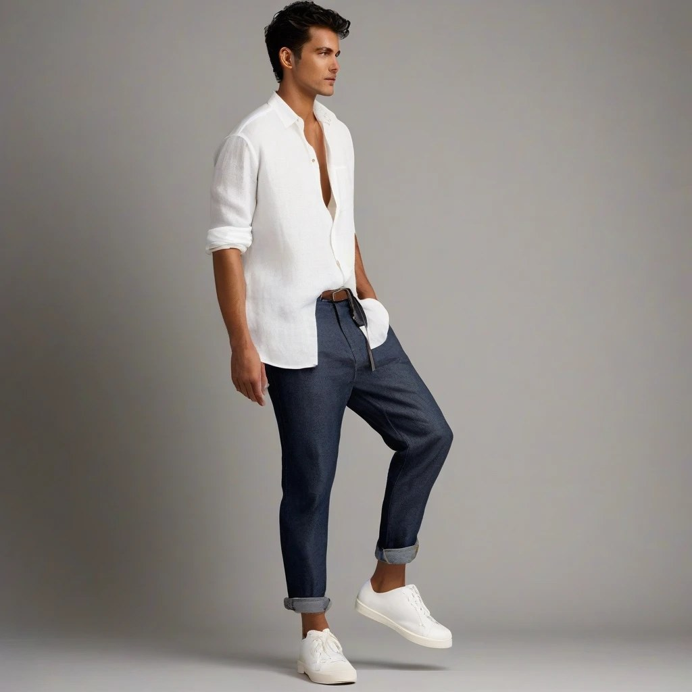

# 👗 AI Fashion Stylist Agent

An agentic AI system that recommends personalised outfits based on occasion, gender, weather, and time of day — combining **LangGraph orchestration**, **multimodal RAG retrieval**, and **generative image synthesis**.

> Built as a portfolio project demonstrating production-oriented AI engineering in a fashion context.

---

## Architecture

```
User Input (occasion, gender, time, weather, style)
        ↓
[LangGraph Agent]
        ↓
  Tool 1 → Context Builder      (LLM: style brief from raw inputs)
  Tool 2 → RAG Retriever        (FashionCLIP + ChromaDB: semantic item search)
  Tool 3 → Outfit Composer      (LLM: structured JSON outfit selection)
        ↓ (retries on parse failure, max 2x)
  Tool 4 → Image Generator      (DALL-E 3 or SDXL: outfit visualisation)
  Tool 5 → Stylist Narrator     (LLM: editorial outfit explanation)
        ↓
Final Output: image + outfit pieces + stylist narration
```

**Key design choices:**
- **LangGraph** over bare LangChain — stateful graph with conditional retry logic, not a fixed linear chain
- **FashionCLIP** (Marqo, Apache 2.0) over generic CLIP — trained on 1M+ fashion items, 57% better text-to-image retrieval
- **ChromaDB** with metadata filtering — gender-aware retrieval without custom query logic
- **Dual-mode generation** — free local SDXL during development, DALL-E 3 for the final deployed demo

---

## Tech Stack

| Layer | Technology |
|---|---|
| Agent orchestration | LangGraph |
| LLM (dev) | Ollama (llama3, local) |
| LLM (prod) | GPT-4o via OpenAI API |
| Embeddings | FashionCLIP (`patrickjohncyh/fashion-clip`) |
| Vector store | ChromaDB |
| Image gen (dev) | Stable Diffusion XL (local) |
| Image gen (prod) | DALL-E 3 via OpenAI API |
| Dataset | Polyvore-U (HuggingFace) |
| API | FastAPI |
| Frontend | Streamlit |
| Deployment | Hugging Face Spaces |

---

## Setup

### Prerequisites
- Python 3.11+
- [Ollama](https://ollama.com) installed and running
- NVIDIA GPU recommended for SDXL (CPU works but is slow)

### 1. Clone and install

```powershell
git clone https://github.com/<your-username>/fashion-stylist-agent
cd fashion-stylist-agent
python -m venv venv
venv\Scripts\activate
pip install -r requirements.txt
```

### 2. Pull the local LLM

```powershell
ollama pull llama3
```

### 3. Configure environment

```powershell
copy .env.example .env
# Edit .env if needed — defaults work for local development
```

### 4. Ingest the dataset

```powershell
python data/ingest_polyvore.py
```

This downloads FashionCLIP (~400MB) and the Polyvore dataset, then populates ChromaDB. Run once.

### 5. Start the API

```powershell
uvicorn api.main:app --reload
```

### 6. Start the frontend (new terminal)

```powershell
streamlit run app/streamlit_app.py
```

Open [http://localhost:8501](http://localhost:8501).

---

## Switching to OpenAI for the final demo

Edit `.env`:

```
USE_OPENAI=true
OPENAI_API_KEY=sk-...
```

Restart both servers. Cost: ~£3–5 for a full demo session.

---

## Project Structure

```
fashion-stylist-agent/
├── agent/
│   ├── graph.py          # LangGraph orchestration + retry logic
│   ├── tools.py          # 5 agent tools as callable functions
│   └── state.py          # AgentState dataclass
├── rag/
│   ├── embeddings.py     # FashionCLIP wrapper (text + image)
│   ├── vector_store.py   # ChromaDB setup, ingestion, querying
│   └── retriever.py      # Called by agent Tool 2
├── generation/
│   └── image_gen.py      # DALL-E 3 / SDXL dual-mode generation
├── api/
│   └── main.py           # FastAPI endpoints
├── app/
│   └── streamlit_app.py  # Web frontend
├── data/
│   └── ingest_polyvore.py
├── tests/                # pytest suite for the agent graph (fakes for the heavy parts)
├── docs/                 # example output
├── requirements.txt
├── requirements-dev.txt  # adds pytest
└── .env.example
```

---

---

## Example output

<p align="center"></p>

An outfit generated end to end during testing, running locally with SDXL. Inputs: occasion **Casual Day out**, gender **male**, weather **sunny**, time of day **morning**, style preference **baggy outfit**. The agent built a style brief, retrieved items, composed the outfit and rendered it. Small details such as belts and hands can come out wrong, as they do here (see Limitations).

---

## Testing

```bash
pip install -r requirements-dev.txt
pytest
```

The tests swap the retrieval and image-generation modules for light fakes and exercise the agent's own logic with a scripted LLM, so they need no GPU, model download or API key. They cover the normal run, JSON wrapped in markdown fences, a malformed reply that is retried and recovers, retries that stop after two attempts, and an empty retrieval.

---

## Limitations

- Recommendations come only from the items ingested from the Polyvore-U dataset.
- The outfit composer relies on the LLM returning valid JSON. A bad reply is retried up to twice, after which the run stops with an error.
- There is no formal evaluation of outfit quality yet; the tests check the agent's logic, not how good the outfits are.
- Image models can produce artifacts, and SDXL on a CPU is slow.
